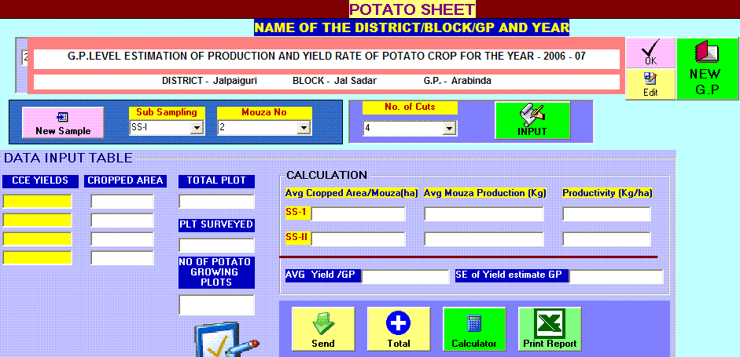



## agricultural statistics

### Description

This code is a real life example and is used by a govt sector

The code is for agricultural statistics in a minutes

User can Learn How to use Dynamic Array ,Excel Macro, Text file reading etc. and more..

I use two User control LynxGrid and UPB Which is available in PSC

Thanks the Developers of these Controls

enjoy the code
 
### More Info
 
Select appropriate location ( year-&gt; district-&gt;block -&gt;GP) then ok

Then sub sample -&gt;Mouza No-&gt; No of cuts -&gt; Inputs(1 to 10)

Then fill the appropriate field and then send then total

then click new sample and do as follows

then click print report

COPY THE FILES

Hi.txt &amp; HiDate.txt to c:\Windows  directory

Use password : 13102k

Output the result in excel format

             |
---                |---
**Submitted On**   |2009-10-03 02:58:20
**By**             |[Tatai Basu](https://github.com/Planet-Source-Code/PSCIndex/blob/master/ByAuthor/tatai-basu.md)
**Level**          |Intermediate
**User Rating**    |4.0 (8 globes from 2 users)
**Compatibility**  |VB 5\.0, VB 6\.0, VBA MS Excel
**Category**       |[Complete Applications](https://github.com/Planet-Source-Code/PSCIndex/blob/master/ByCategory/complete-applications__1-27.md)
**World**          |[Visual Basic](https://github.com/Planet-Source-Code/PSCIndex/blob/master/ByWorld/visual-basic.md)
**Archive File**   |[agricultur21651410142009\.zip](https://github.com/Planet-Source-Code/tatai-basu-agricultural-statistics__1-72551/archive/master.zip)

